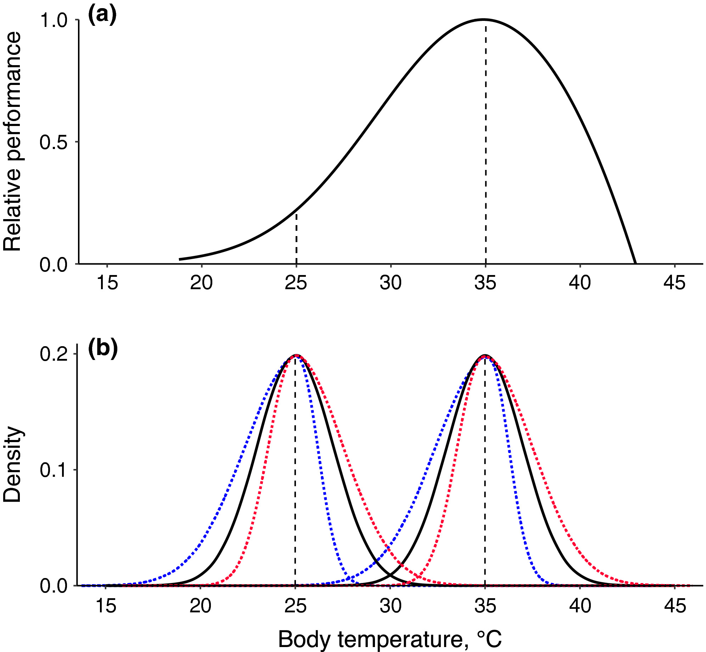

```{r setup, include=FALSE}
knitr::opts_chunk$set(echo = TRUE)
```

Figure 2: (a) Thermal performance curve. (b) Body temperature distributions (solid black curves = normal distributions, red dashed curves = right-skewed and blue dashed lines = left-skewed). Vertical dashed lines indicate modal temperatures for each distribution. Median minus mean differences are 0.27°C for left-skewed distributions and −0.24°C for right-skewed distributions. Skewness coefficients are −0.67°C and +0.49°C respectively. These compare roughly with lizard coefficients in Table S1. 

Figure 2a shows a thermal performance curve with an optimum at 35°C, and Figure 2b shows two sets of p(Tb) distributions centred at low (25°C) or high (35°C) temperatures, respectively, and with normal (solid black), left-skewed (blue) and right-skewed (red) Tb distributions.

*Note on package installation:
Install the latest version of this package by entering the following:
install.packages("remotes")
remotes::install_github("padpadpadpad/rTPC")

```{r load packages}
library(rTPC)
library(nls.multstart)
library(broom)
```

I'm under the impression that Figure 2 was constructed as an example to illustrate why skewness matters in the case of body temperature observed in lizards. However, I believe it was not constructed using the data provided on lizards. Therefore, I will not be replicating this figure. 

## Comparison with Original Figure 2

For comparison, we have the origial plot:




Figure 3: Body temperature skewness (jittered) for desert lizards, with values by family (or by subfamily for Agamidae) and by continent. Three families are represented by one species. No pattern (desert, taxon) is evident.

```{r kl}
f <- curl("https://raw.githubusercontent.com/maekell98/nkelley-data-replication-assignment/main/doi_10-5/KalahariTbData.csv")
kl <- read.csv(f, header = TRUE, sep = ",", stringsAsFactors = FALSE)
kl['desert']='Africa'
head(kl)

klskew <- kl %>%
    group_by(family) %>%
    summarise(
        meanTb = round(mean(Tb, na.rm = TRUE), digits = 2),
        medTb  = median(Tb,na.rm = TRUE),
        MAD = round(mad(Tb, na.rm = TRUE), digits = 2),
        minTb = min(Tb, na.rm = TRUE),
        maxBT = max(Tb, na.rm = TRUE),
        nBT = n(),
        SkewCoef = agostino.test(Tb, alternative = "greater")$statistic[1],
        SkewP = agostino.test(Tb, alternative = "greater")$p.value,
        desert = unique(desert))
```

```{r al}
g <- curl("https://raw.githubusercontent.com/maekell98/nkelley-data-replication-assignment/main/doi_10-5/AustraliaTbData.csv")
al<- read.csv(g, header = TRUE, sep = ",", stringsAsFactors = FALSE)
al['desert']='Australia'
names(al)[4]<-paste("Tb")
head(al)

alskew <- al %>%
    group_by(family) %>%
    summarise(
        meanTb = round(mean(Tb, na.rm = TRUE), digits = 2),
        medTb  = median(Tb,na.rm = TRUE),
        MAD = round(mad(Tb, na.rm = TRUE), digits = 2),
        minTb = min(Tb, na.rm = TRUE),
        maxBT = max(Tb, na.rm = TRUE),
        nBT = n(),
        SkewCoef = agostino.test(Tb, alternative = "greater")$statistic[1],
        SkewP = agostino.test(Tb, alternative = "greater")$p.value,
        desert = unique(desert))
```

```{r nl}
h <- curl("https://raw.githubusercontent.com/maekell98/nkelley-data-replication-assignment/main/doi_10-5/NorthAmericanTbData.csv")
nl <- read.csv(h, header = TRUE, sep = ",", stringsAsFactors = FALSE)
nl['desert']='North Amer.'
head(nl)

nlskew <- nl %>%
    group_by(family) %>%
    summarise(
        meanTb = round(mean(Tb, na.rm = TRUE), digits = 2),
        medTb  = median(Tb,na.rm = TRUE),
        MAD = round(mad(Tb, na.rm = TRUE), digits = 2),
        minTb = min(Tb, na.rm = TRUE),
        maxBT = max(Tb, na.rm = TRUE),
        nBT = n(),
        SkewCoef = agostino.test(Tb, alternative = "greater")$statistic[1],
        SkewP = agostino.test(Tb, alternative = "greater")$p.value,
        desert = unique(desert))
```

```{r combining dfs}
#bind data -- retain all columns but combine columns in common; NA for columns not in common
#https://www.geeksforgeeks.org/combine-two-dataframes-in-r-with-different-columns/
ld <- bind_rows(kl, nl, al)
#oop. Maybe I didn't need this.

#combine skew summaries:
lskew <- bind_rows(nlskew, alskew, klskew)

```

```{r dot plot}
#make a dot plot: http://r-statistics.co/Top50-Ggplot2-Visualizations-MasterList-R-Code.html
lplot <- 
  ggplot(lskew, aes(x=SkewCoef, y=family, group=desert)) +
  #specify shape/color of points: http://www.sthda.com/english/wiki/ggplot2-point-shapes
  geom_point(aes(shape=desert, color=desert), size = 3) +
  scale_shape_manual(values=c(17, 8, 25))+
  scale_color_manual(values=c('grey','blue', 'red'))+
  scale_fill_manual(values=c('grey','blue', 'red'))+
  labs(x = "Skewness", y = "Families or subfamilies") +  
  theme_classic() +
  xlim(-2.0, 0.5) +
  scale_x_continuous(breaks = c(-2.0, -1.5, -1.0, -0.5, 0.0, 0.5)) +
   geom_vline(aes(xintercept=0),
            color="black", linetype="dashed") +
  xlim(-2.0, 0.5)
lplot

```