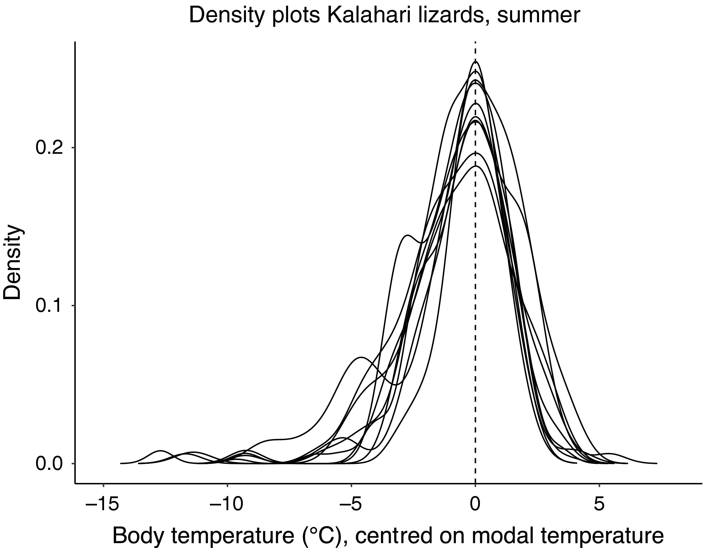
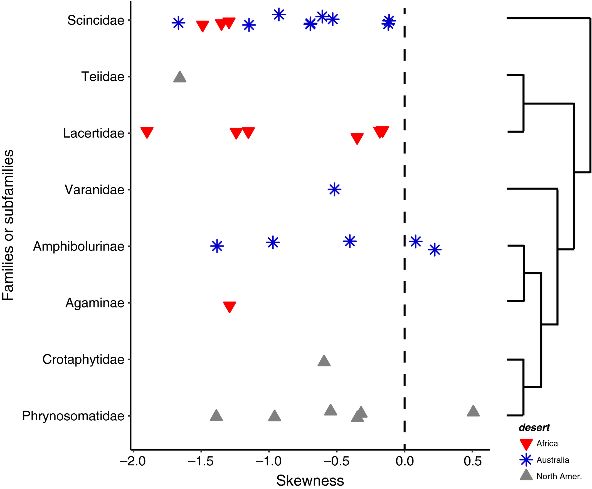
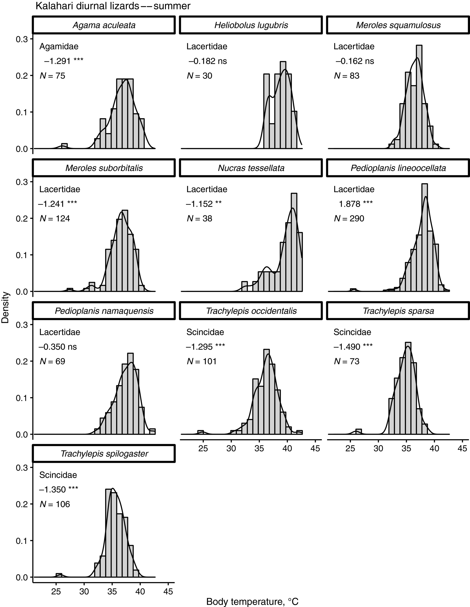

```{r setup, include=FALSE}
knitr::opts_chunk$set(echo = TRUE, warning = FALSE, comment = "##", prompt = TRUE, tidy = TRUE, tidy.opts = list(width.cutoff = 75), fig.path = "img/")
```


# Introduction

short description of the study and of the specific data and replication analyses you will be performing, to orient your reader. Outline (briefly) the goal of the original paper, the data set used, and the analyses conducted, then describe which you will replicate. You should also demonstrate how you read your datafile into R, and show a few lines of raw data in your output (e.g., using head()).

## Preliminaries
Install {moments}. 
Load the following packages:
```{r load packages}
library(curl)
library(ggplot2)
library(tidyverse)
library(dplyr)
library(moments)
```

# Figure 1 Replication


Figure 1: Density plots of Tb of 10 Kalahari lizard species in summer: distributions are centred on modal temperature of each species. Left skewness is visually evident for many species and significant in seven (Table S1)

"Because these analyses evaluate an explicit (a priori) hypothesis that Tb distributions are left-skewed, we used one-tailed tests."


```{r load data}
f <- curl("https://raw.githubusercontent.com/maekell98/nkelley-data-replication-assignment/main/doi_10-5/KalahariTbData.csv")
kl <- read.csv(f, header = TRUE, sep = ",", stringsAsFactors = FALSE)
head(kl)
```
Note: Southern latitude summer = December through February. Therefore, we must subset the data by date to include only data collected in the summer months. 

"We arbitrarily set a minimum sample size of N = 23 Tb for inclusion." Since Trachylepis variegata does not have this many samples, it will be excluded from further analysis at the end of the the following chunk. 

```{r subset by date}
#in order to subset by date, dates must be coerced into a format recognized by r:
#date formatting: https://stackoverflow.com/questions/38146160/how-to-convert-dd-mm-yy-to-yyyy-mm-dd-in-r
kl$date <- as.Date(kl$date, "%m/%d/%Y")

#kls = kalahari lizards summer subset
#date subsetting: https://www.statology.org/subset-by-date-range-in-r/
kld <- kl[kl$date >= "0069-12-02" & kl$date <= "0070-02-27", ]

#not enough data for species Trachylepis spilogaster, deleting for further analyis
kls <- subset(kld, species!="Trachylepis variegata")
head(kls)
```

In order to obtain density plots by species, we first subset by species:
```{r subset by species}
#used unique to quickly get a list of species in the kl data set
unique(kld$species)

#define function for calculating mode: https://r-lang.com/mode-in-r/
getmode <- function(v) {
 uniqv <- unique(v)
 uniqv[which.max(tabulate(match(v, uniqv)))]
}

#now we create a subset for each species in which the mode of each Tb is adjusted to 0 and represented by column Tbm
ss1 <- subset(kls, species == "Agama aculeata") %>%
  mutate(Tbm = Tb - getmode(Tb))

ss2 <- subset(kls, species == "Heliobolus lugubris") %>%
  mutate(Tbm = Tb - getmode(Tb))

ss3 <- subset(kls, species == "Meroles squamulosus") %>%
  mutate(Tbm = Tb - getmode(Tb))

ss4 <- subset(kls, species == "Meroles suborbitalis") %>%
  mutate(Tbm = Tb - getmode(Tb))

ss5 <- subset(kls, species == "Nucras tessellata") %>%
  mutate(Tbm = Tb - getmode(Tb))

ss6 <- subset(kls, species == "Pedioplanis lineoocellata") %>%
  mutate(Tbm = Tb - getmode(Tb))

ss7 <- subset(kls, species == "Pedioplanis namaquensis")%>%   mutate(Tbm = Tb - getmode(Tb))

ss8 <- subset(kls, species == "Trachylepis occidentalis") %>% mutate(Tbm = Tb - getmode(Tb))

ss9 <- subset(kls, species == "Trachylepis sparsa") %>%
  mutate(Tbm = Tb - getmode(Tb))

ss10 <- subset(kls, species == "Trachylepis spilogaster") %>% mutate(Tbm = Tb - getmode(Tb))
```

Now we can run the ggplot. In order to show all the species subsets on the same plot, we simply add geom_density() with each of the different subsets. 
```{r Fig1}
#constructing density  plots: http://www.sthda.com/english/wiki/ggplot2-density-plot-quick-start-guide-r-software-and-data-visualization
s <- ggplot(ss1, aes(x=Tbm)) + 
  geom_density() +
  geom_density(data = ss2) +
  geom_density(data = ss3) +
  geom_density(data = ss4) +
  geom_density(data = ss5) +
  geom_density(data = ss6) +
  geom_density(data = ss7) +
  geom_density(data = ss8) +
  geom_density(data = ss9) +
  geom_density(data = ss10) +
  #add mean line:
  geom_vline(aes(xintercept=0),
            color="black", linetype="dashed") +
  #classic theme seems most appropriate (removes grid background, adds tick marks, black and white)
  theme_classic() +
  #set axes:
  xlim(-15, 5) + ylim(0, 0.5)+
  #set tick marks:
  scale_y_continuous(breaks = c(0.0, 0.1, 0.2))+
  scale_x_continuous(breaks = c(-15, -10, -5, 0, 5))+
  #add labels,
  #code for degrees celsius symbol: https://stackoverflow.com/questions/51799118/writing-the-symbol-degrees-celsius-in-axis-titles-with-r-plotly/51799161 
  labs(title="Density plots Kalahari lizards, summer",x="Body temperature (\u00B0C), centered on modal temperature", y = "Density")
s
```

We can see from the figure that most Kalahari lizard species blood temperature is exhibits left skewness. 

## Comparison with Original Figure 1
For comparison, we have the origial plot:



# Figure 3 Replication


Figure 3: Body temperature skewness (jittered) for desert lizards, with values by family (or by subfamily for Agamidae) and by continent. Three families are represented by one species. No pattern (desert, taxon) is evident.

```{r kl}
f <- curl("https://raw.githubusercontent.com/maekell98/nkelley-data-replication-assignment/main/doi_10-5/KalahariTbData.csv")
kl <- read.csv(f, header = TRUE, sep = ",", stringsAsFactors = FALSE)
kl['desert']='Africa'
head(kl)

#Basic R script for calculating stats describing Tb distributions:
klskew <- kl %>%
    group_by(family) %>%
    summarise(
        meanTb = round(mean(Tb, na.rm = TRUE), digits = 2),
        medTb  = median(Tb,na.rm = TRUE),
        MAD = round(mad(Tb, na.rm = TRUE), digits = 2),
        minTb = min(Tb, na.rm = TRUE),
        maxBT = max(Tb, na.rm = TRUE),
        nBT = n(),
        SkewCoef = agostino.test(Tb, alternative = "greater")$statistic[1],
        SkewP = agostino.test(Tb, alternative = "greater")$p.value,
        desert = unique(desert))
```

```{r al}
g <- curl("https://raw.githubusercontent.com/maekell98/nkelley-data-replication-assignment/main/doi_10-5/AustraliaTbData.csv")
al<- read.csv(g, header = TRUE, sep = ",", stringsAsFactors = FALSE)
al['desert']='Australia'
names(al)[4]<-paste("Tb")
head(al)

alskew <- al %>%
    group_by(family) %>%
    summarise(
        meanTb = round(mean(Tb, na.rm = TRUE), digits = 2),
        medTb  = median(Tb,na.rm = TRUE),
        MAD = round(mad(Tb, na.rm = TRUE), digits = 2),
        minTb = min(Tb, na.rm = TRUE),
        maxBT = max(Tb, na.rm = TRUE),
        nBT = n(),
        SkewCoef = agostino.test(Tb, alternative = "greater")$statistic[1],
        SkewP = agostino.test(Tb, alternative = "greater")$p.value,
        desert = unique(desert))
```

```{r nl}
h <- curl("https://raw.githubusercontent.com/maekell98/nkelley-data-replication-assignment/main/doi_10-5/NorthAmericanTbData.csv")
nl <- read.csv(h, header = TRUE, sep = ",", stringsAsFactors = FALSE)
nl['desert']='North Amer.'
head(nl)

nlskew <- nl %>%
    group_by(family) %>%
    summarise(
        meanTb = round(mean(Tb, na.rm = TRUE), digits = 2),
        medTb  = median(Tb,na.rm = TRUE),
        MAD = round(mad(Tb, na.rm = TRUE), digits = 2),
        minTb = min(Tb, na.rm = TRUE),
        maxBT = max(Tb, na.rm = TRUE),
        nBT = n(),
        SkewCoef = agostino.test(Tb, alternative = "greater")$statistic[1],
        SkewP = agostino.test(Tb, alternative = "greater")$p.value,
        desert = unique(desert))
```

```{r combining dfs}
#bind data -- retain all columns but combine columns in common; NA for columns not in common
#https://www.geeksforgeeks.org/combine-two-dataframes-in-r-with-different-columns/
ld <- bind_rows(kl, nl, al)
#oop. Maybe I didn't need this.

#combine skew summaries:
lskew <- bind_rows(nlskew, alskew, klskew)

```

```{r Fig3}
#make a dot plot: http://r-statistics.co/Top50-Ggplot2-Visualizations-MasterList-R-Code.html
lplot <- 
  ggplot(lskew, aes(x=SkewCoef, y=family, group=desert)) +
  #specify shape/color of points: http://www.sthda.com/english/wiki/ggplot2-point-shapes
  geom_point(aes(shape=desert, color=desert), size = 3) +
  scale_shape_manual(values=c(25, 8, 17))+
  scale_color_manual(values=c('red', 'blue', 'grey48'))+
  scale_fill_manual(values='red')+
  labs(x = "Skewness", y = "Families or subfamilies") +  
  theme_classic() +
  xlim(-2.0, 0.5) +
  scale_x_continuous(breaks = c(-2.0, -1.5, -1.0, -0.5, 0.0, 0.5)) +
   geom_vline(aes(xintercept=0),
            color="black", linetype="dashed") +
  xlim(-2.0, 0.5)
lplot

```

## Comparison with Original Figure 3

For comparison, we have the original plot:



You can see my plot did not include the phylogenetic comparison. It also contains different families compared to the original plot. I was unable to find the families used in this plot when I was going through the data. I am not sure if they used other outside information to further classify families/subfamilies, but the lack of clarification made it impossible for me to truly replicate their figure. 

# Figure 4 Replication


Figure 4: Body temperature histograms (with density curves) for Kalahari lizards in summer. Each panel gives the species name, family, D'Agostino skewness coefficient with significance levels adjusted for multiple comparisons (*p < .05, **p < .01 and ***p < .001) and sample size.

```{r Fig4, fig.width=8,fig.height=11}
#to specify figure dimensions: https://stackoverflow.com/questions/39634520/specify-height-and-width-of-ggplot-graph-in-rmarkdown-knitr-output

#prep data frame for individual facet annotations:
ann <- kls %>%
  group_by(species) %>%
  summarise(
    Family = unique(family),
    )
sig <- c('-1.291 ***', '-0.182 ns', '0.162 ns', '-1.241 ***', '-1.152 **', '1.878 ***', '-0.350 ns', '-1.295 ***', '-1.490 ***', '-1.350 ***')
n <- c('N = 75', 'N = 30', 'N = 83', 'N = 124', 'N = 38', 'N = 290', 'N = 69', 'N = 101', 'N = 73', 'N = 106')
ann <- cbind(ann, sig, n)
#n and sig can be found in skewTb data frame as well, but I was having trouble getting these onto my ggplots using just the skewTb df, so I created a new dataframe with the relevant information. 

#code for ggplot histogram+density plot: http://www.sthda.com/english/wiki/ggplot2-density-plot-quick-start-guide-r-software-and-data-visualization
dph1 <- kls %>% 
  ggplot(aes(x=Tb))+
  geom_histogram(aes(y=..density..), alpha=0.5, position="identity", colour="black", fill="grey")+
  geom_density(alpha=.2)+
  theme_classic()+
  #set axes:
  xlim(25, 45) + ylim(0, 0.3)+
  #facet_wrap(): https://ggplot2-book.org/facet.html
  #arrange grid (by species) and coerce into 3x4 using nrow
  facet_wrap(~species, nrow = 4)+
  #add annotations using geom_text: https://r-graphics.org/recipe-annotate-facet
  geom_text(data = ann,x = 29, y = 0.28, aes(label = Family))+
  geom_text(data = ann,x = 29, y = 0.24, aes(label = sig))+
  geom_text(data = ann,x = 29, y = 0.2, aes(label = n))+   #labels:
  labs(title="Kalahari diurnal lizards--summer",x="Body temperature (\u00B0C)", y = "Density")
dph1
```

## Comparison with Original Figure 4

For comparison, we have the original plot:



